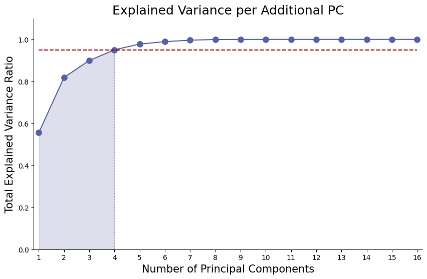
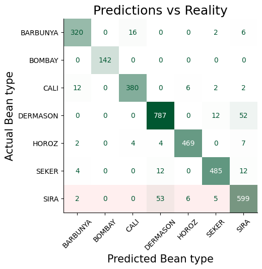

# Classification of Dry Bean types using Machine Learning

This project trained and evaluated several classification models to identify different types of dry bean, based on features related to the size and shape of the beans.

## Contents
1. [Data](#data)
2. [Principal Component Analysis](#principal-component-analysis)
3. [Classifier Evaluation & Hyperparameter Tuning](#classifier-evaluation--hyperparameter-tuning)
4. [Model Performance & Conclusions](#model-performance--conclusions)
5. [Dependencies](#dependencies)

## Data
- The dataset was sourced from [UCI ML repository](https://archive.ics.uci.edu/dataset/602/dry+bean+dataset) and was originally from a [study](https://www.sciencedirect.com/science/article/abs/pii/S0168169919311573?via%3Dihub) at Selcuk University in Turkey (and thus uses Turkish names for bean types).
- 7 types of dry bean are represented in the data: Barbunya, Bombay, Cali, Dermason, Horoz, Seker and Sira.
- The dataset comprises 16 numerical features of 13,611 beans, generated from high-resolution images of the beans. The features and are based on pixel area and geometric relationships, including area, axes lengths, eccentricity, solidity and several shape forms defined by mathematical formulae (see notebook).
- The data was split into training and test sets, and then scaled using the sklearn `StandardScaler` as part of the pipeline.

## Principal Component Analysis
- Principal Component Analysis was performed to see if dimensionality and training times could be reduced.
- 95% of the variance could be explained by 4 principal components, which broadly represented 'Length', 'Width', 'Concavity' and 'Squareness':

- Ultimately, while initial PCA results were promising, it was not used in the final model given lower training scores and the size of the dataset. On a larger training set, however, it could still be useful to reduce training times and the risk of overfitting.

## Classifier Evaluation & Hyperparameter Tuning
- 5 classifier models were initially evaluated on the training data: `LogisticRegression`, `DecisionTreeClassifier`, `RandomForestClassifier`, `SVC` (SupportVectorClassifier) and `KNeighboursClassifier`.
- After comparison with default parameters using k-fold cross validation, the three models with the highest fold scores (LogReg, SVC and RF) underwent further hyperparameter tuning using GridSearchCV.
- **SVC** was selected as the final model, using the RBF kernel, a C value of 2 and gamma at the default scale.

## Model Performance & Results
- Given the aim of classifying each bean correctly, and the classes were fairly balanced in the dataset, *accuracy* (correct predictions / all predictions) was chosen as the metric to evaluate the success of the model.

- When evaluated on the test data, the model had an accuracy of **93.51%** (average precision 94.68%, average recall 94.56%).
- The Sira bean was the most difficult for the model to classify, with recall of 90.08% (and precision of 88.35%).
- In conclusion, while the model performs very well at classifying most of the bean types, the boundary between Sira and Dermason significantly reduced the accuracy of the model - on a collection of beans not including one or both of these types, we can expect the model to perform significantly better.

## Dependencies
- Python 3.x
- Sklearn
	- Data preprocessing
	- Classifier models
	- GridSearchCV
	- Confusion Matrix
	- PCA
- Pandas
- Numpy
- Matplotlib & seaborn